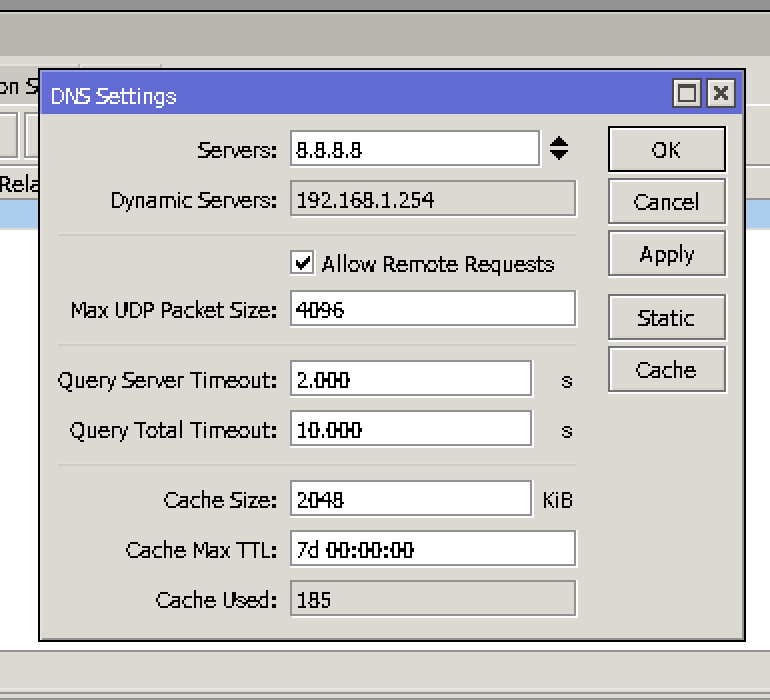

DNS config
===========

1. Add DNS server address. It is not required for normal usecase since router asks parent router for DNS resolution. But we had a problem about the DNS resolution for the hotspot client, so to be safe add the public DNS to the router. Use one of ``1.1.1.1`` or ``8.8.8.8``. Goto ``IP > DNS``.

