Hotspot Setup
==============

1. Run the Hotspot setup wizard. Goto ``IP > Hotspot``. On ``Servers`` tab, click on ``Hotspot Setup``
2. If you are using the Mikrotik router with Wifi. Select the ``bridge`` interface or If you are using the hex series router default hotspot interface would be ``ether-2``. Click on Next

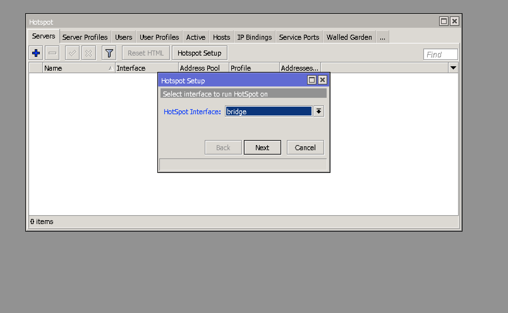

3. Type in the network address. (You might not need to alter ip here, Default works!!!)

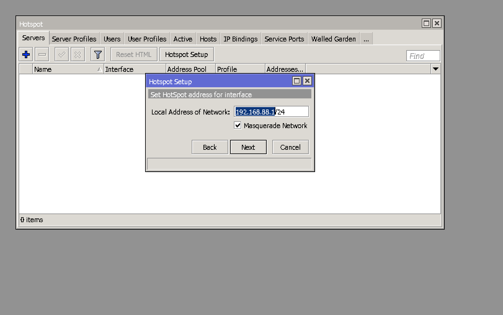

4. Input Address pool

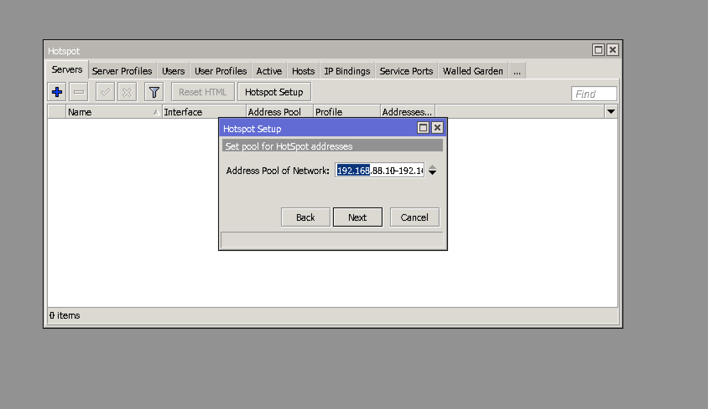

5. SSL certificate. We are not worrying about the SSL for now. Default is fine.

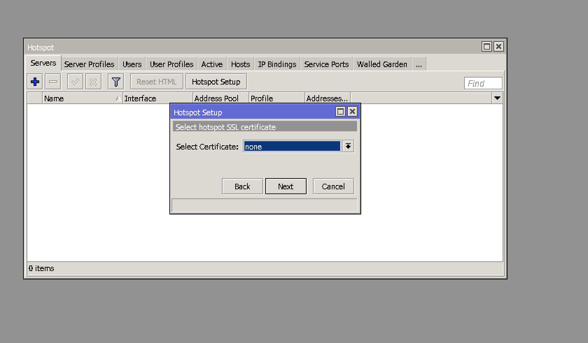

6. SMTP server. We are not worrying about the SMTP either. Default is fine.

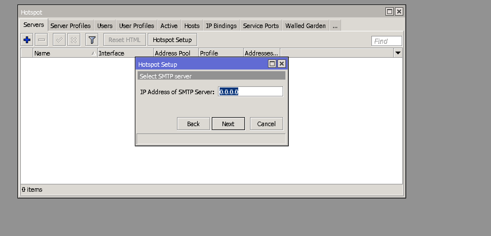

7. DNS name. You can enter the dns name for the router hotspot here. But you can skip this as well.

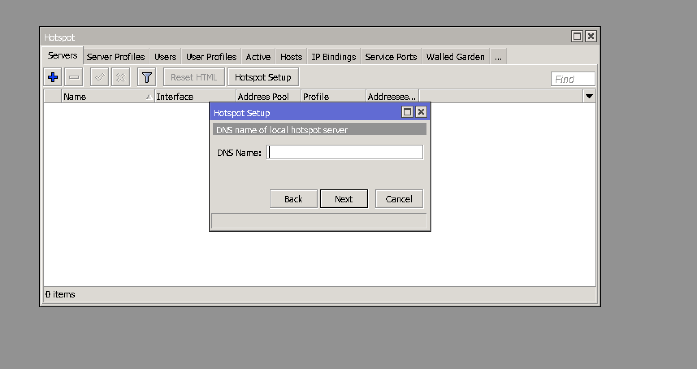

8. Hotspot Username and Password. This is critical consult with the admin.

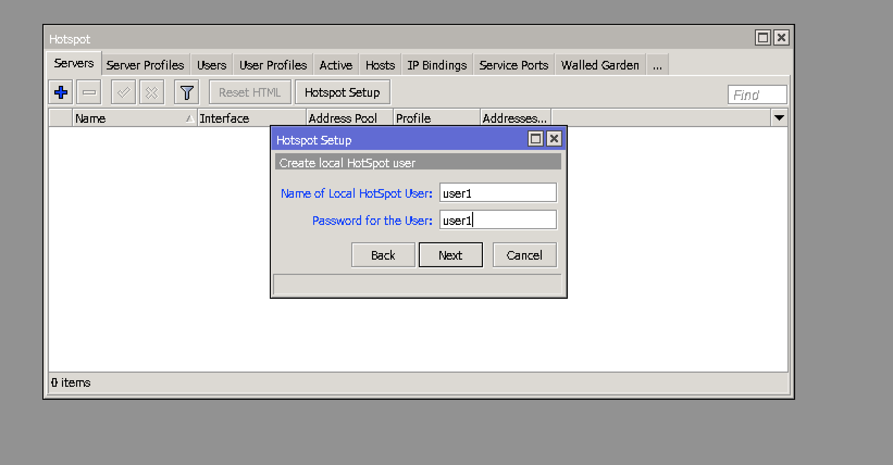

9. HotSpot setup wizard is done. Now get the hotspot template from the http://infinismart.com and upload the files to router. Navigate to ``Files`` and drag and drop the folder.

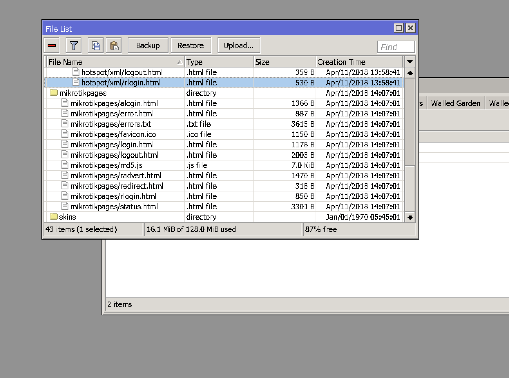

10. Under the ``Hotspot Server Profile``. Change the template directory to folder with your recently copied folder.

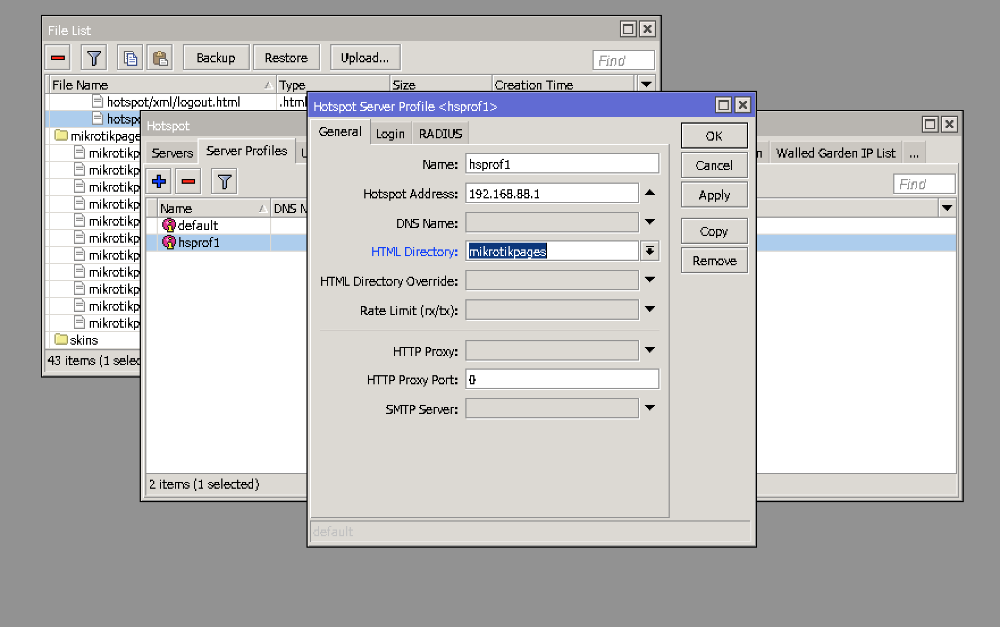

11. Under the ``Login`` tab, uncheck the ``Cookie`` under the ``Loginby``.

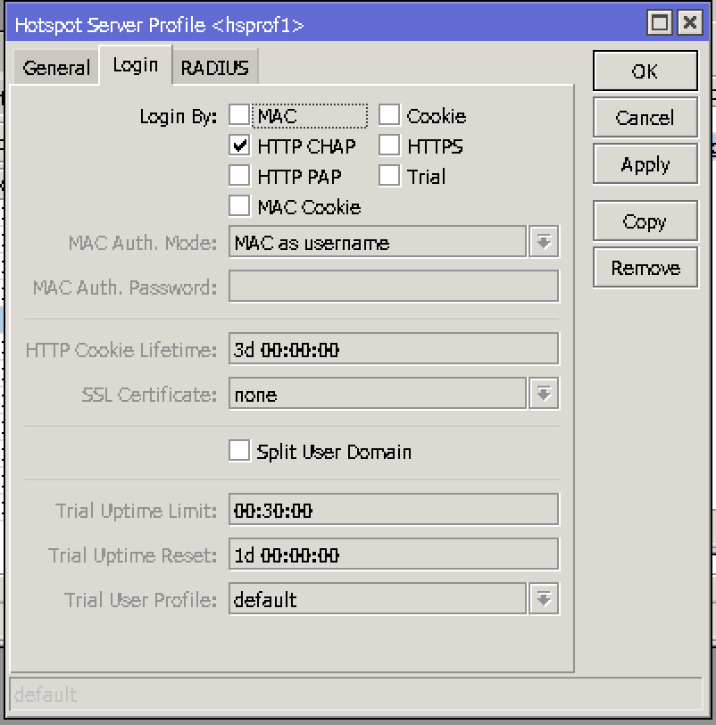

12. Go to the hotspot server. Double click the recently created hotspot server. Change ``Addresses Per MAC`` from ``2`` to ``1``.

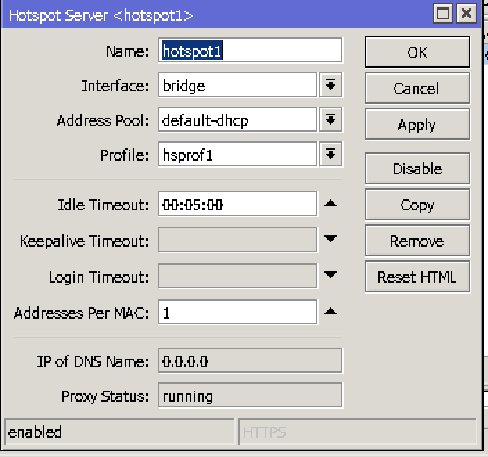

13. Go to User Profile. And Double click the User Profile being used. Change the shared user number to 100+.

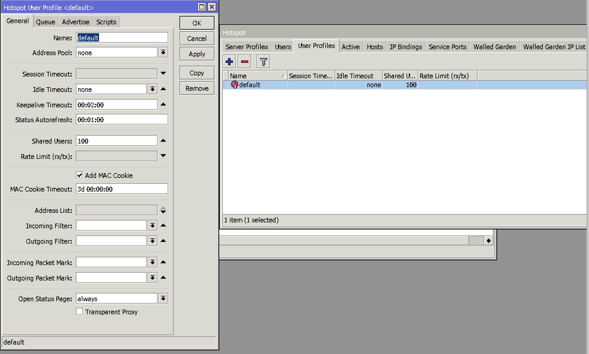

14. Go to Walled Garden Enty. Click add button. Add select ``hotspot name`` in server and add entry for ``cdnjs.cloudflare.com`` and ``infiniasmart.com``.

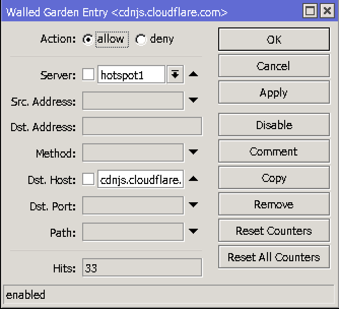

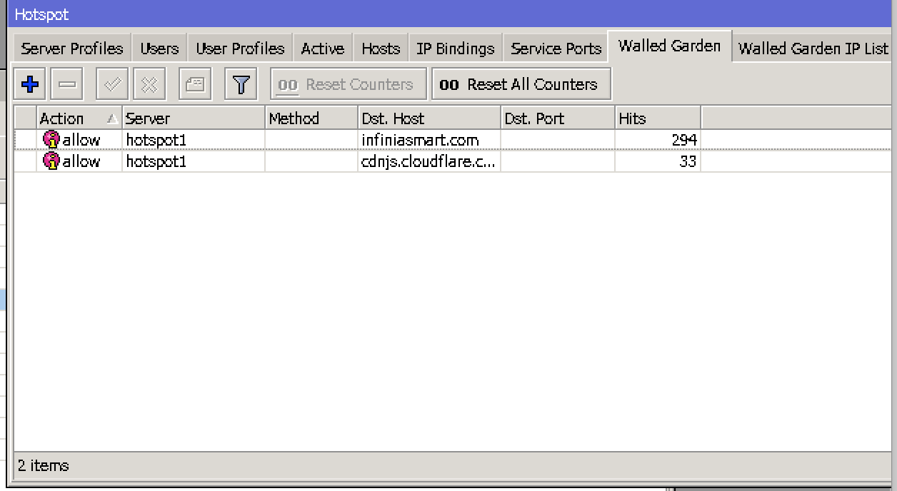

And the setup is complete. Enjoy your day!!