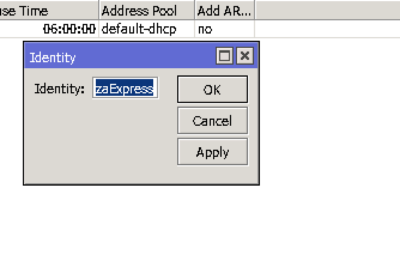
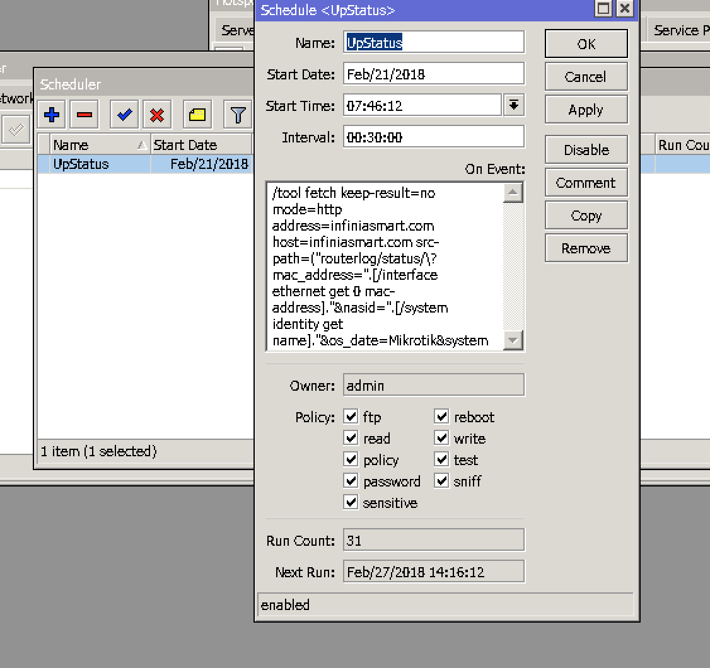

Make Router Ping to Server
===========================

1. Change the router identity from ``System > Identity``. This will be used as router identifier in our backend portion. Make it unique to system and **make sure that it has no space character**.

2. Add Scheduler script to router from ``System > Scheduler``.

   * Update the ``script name``.
   * Change the Interval to ``30 minutes``

   * Add the script

   >>>  /tool fetch keep-result=no mode=http address=infiniasmart.com host=infiniasmart.com src-path=("routerlog/status/\?mac_address=".[/interface ethernet get 0 mac-address]."&nasid=".[/system identity get name]."&os_date=Mikrotik&system_time=".[/system clock get time]."&uptime=".[/system resource get uptime]."&load_average=".[/system resource get cpu-load]."&active_users=".[/ip hotspot active print count-only])

