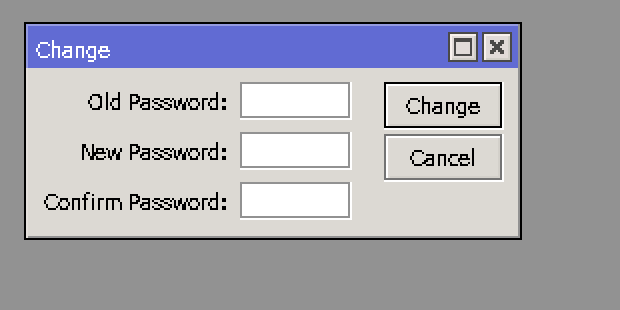
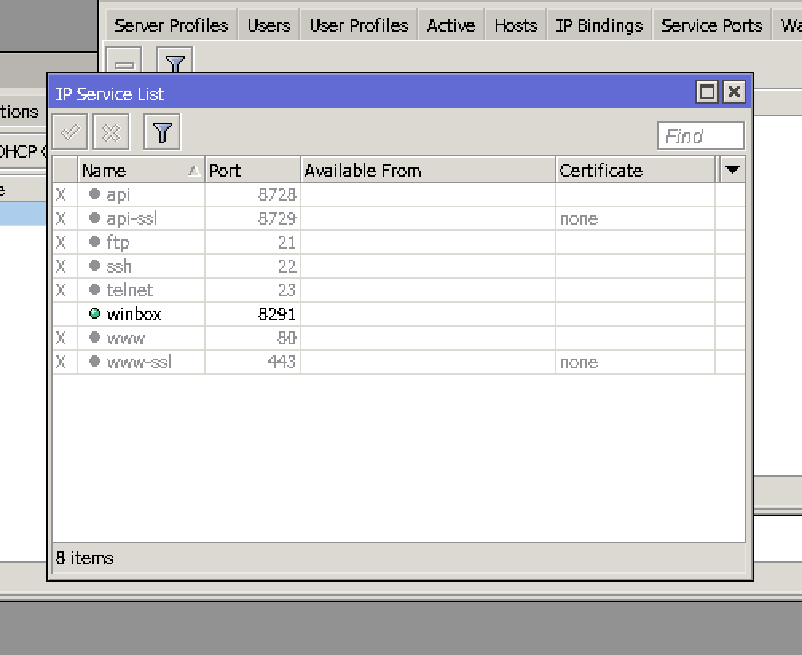

Security Tips for Router
=========================

1. Change default admin password. ``System > Password``

2. Disable ``IP services`` list on routers. Disable all the services except for the winbox goto ``ip > services``

